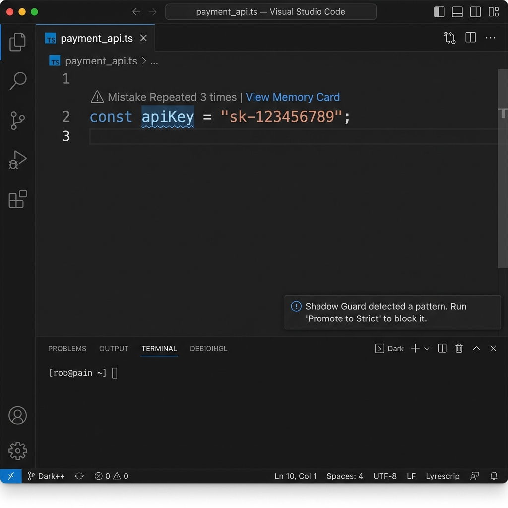

# Engram

**The gateway to code memory.**

Engram is a privacy-first "Shadow Guard" for your AI coding workflow. It creates a semantic memory of your past mistakes and proactively injects them into your AI tools (Cursor, Copilot, Cline) to prevent them continuously.

## Why Engram?

Most AI tools have amnesia. They make the same mistake today that you fixed yesterday.
*   **SonarLint** simply catches syntax errors. It doesn't know *your* history or specific project constraints.
*   **Cloud Tools** require sending your code to external servers. Engram is **100% Local**.
*   **Engram** remembers. It watches your workflow, learns your specific pain points, and stops the AI from repeating them.

"Saved me 2 hours on a Copilot regression where it kept using a deprecated API I explicitly moved away from last week." - Early User

## Core Capabilities

### AI Whisperer (Context Injection)
Don't just fix mistakes, teach your AI to avoid them. Engram translates your repetitive errors into natural language rules.
*   **Universal Support**: Automatically updates configuration files for Cursor and Copilot.
*   **Smart Copy**: Wraps your code with relevant mistake history when pasting into ChatGPT.
*   **Prompt Injection Defense**: Sanitizes all context to ensure security.

### The Shadow Guard (Real-Time Policing)
A firewall for AI-generated code.
*   **Honeymoon Mode**: New mistakes are shown as subtle Info warnings (Blue), giving you a chance to fix them without interruption.
*   **Strict Enforcement**: Promote rules to "Blockers" (Red) only when you need absolute compliance.
*   **Interactive Triage**: Quickly ignore rules for specific file types (like tests) with a single click.

### Mistake Shield
*   **Active Warning System**: Detects when you are about to repeat a known bad pattern.
*   **Memory Cards**: Hover over any warning to see exactly when this mistake happened before and how you fixed it.

## Quick Start

1.  **Install** the extension.
2.  **Code** as usual. Engram learns quietly in the background.
3.  **Paste** smarter. Use "Engram: Smart Copy" when asking AI for help.
4.  **Refine**. Use the blue "Shadow Guard" warnings to tune your rules.

## FAQ

**Q: Does my code leave my computer?**
A: No. Engram is 100% local. All embeddings, rules, and logic run on your machine.

**Q: Will it slow down my editor?**
A: No. The Shadow Guard uses a debounced background process (500ms) to ensure it never blocks your typing.

**Q: Can I share my rules?**
A: Yes! Use `Engram: Import Rules` to load any JSON rule pack. Check out our [Starter Kit](https://github.com/kwstx/Engram) for free bug patterns.

## Community & Extensibility
Engram is designed to be hacked.
*   **Rule Starter Kit**: Run `Engram: Load Starter Kit` to instantly block common bugs (Console logs in prod, AWS Keys, etc).
*   **Build Your Own**: Export your `fingerprints.json` and share it with your team.
*   **Open Source**: Contribute your best patterns to our [GitHub Repo](https://github.com/kwstx/Engram).

## Support
*   [Website](https://www.useengram.com/)
*   [Repository](https://github.com/kwstx/Engram)
*   [Repository](https://github.com/kwstx/Engram)

## Experimental Features (Beta)
**Engram isn't just a memory; it's a psychic companion.**

### Predictive Intuition (Auto-Enabled)
Engram uses local models (Ollama) to predict your next move.
*   **What it does:** Shows ghost-text predictions when you hesitate.
*   **How to Disable:** Go to **Settings** -> Search `Engram` -> Uncheck `Experimental: Predictive Intuition`.

### Opt-In Duel
*   **What it does:** Adds a "Challenge" button to code blocks. Click it to summon a second AI model to critique your code.
*   **How to Disable:** Go to **Settings** -> Uncheck `Experimental: Opt In Duel`.

*   [Privacy Policy](https://www.useengram.com/privacy.html)
